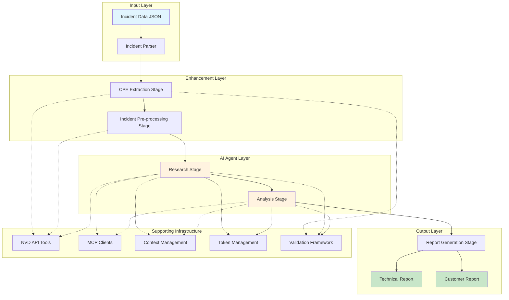
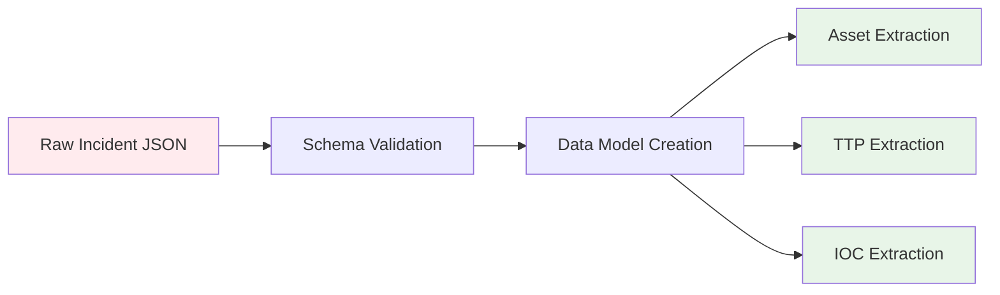
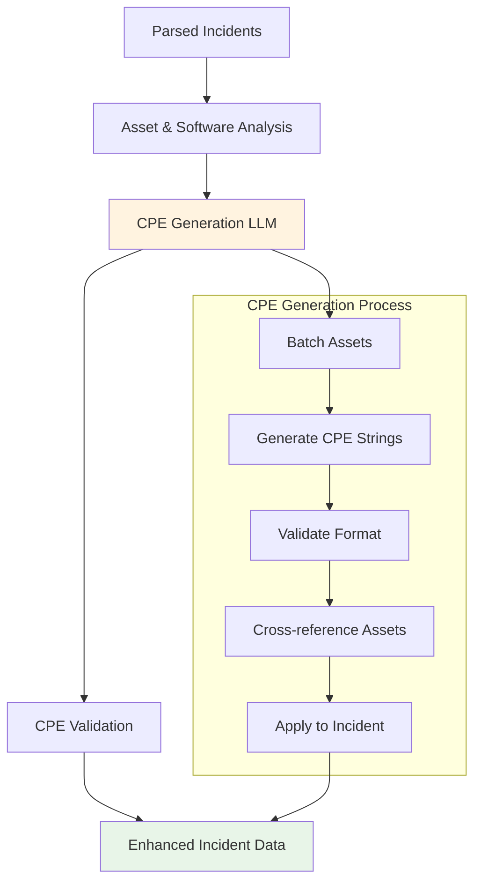
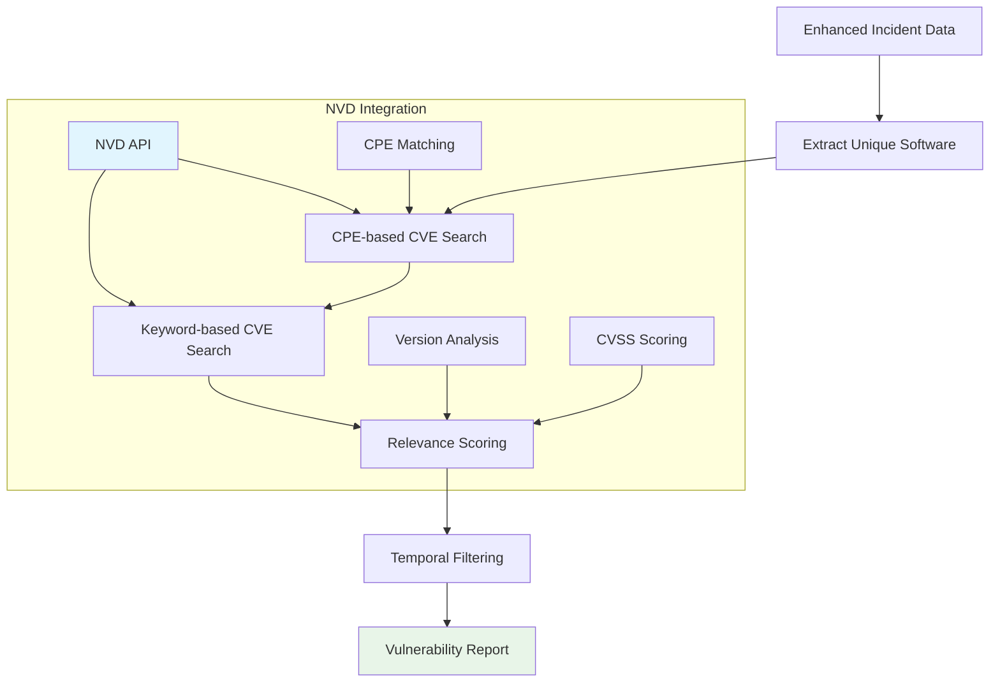
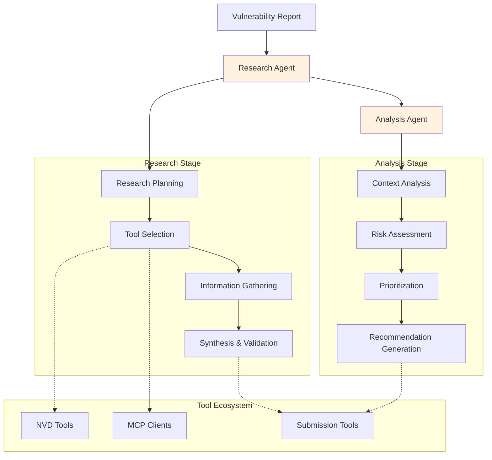
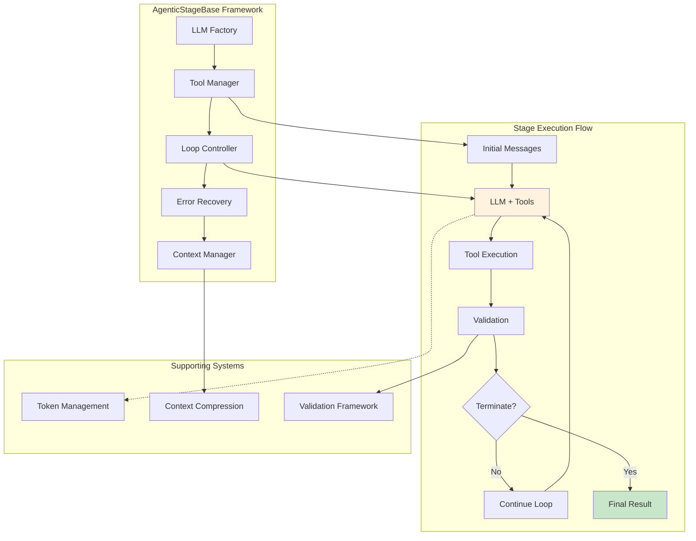
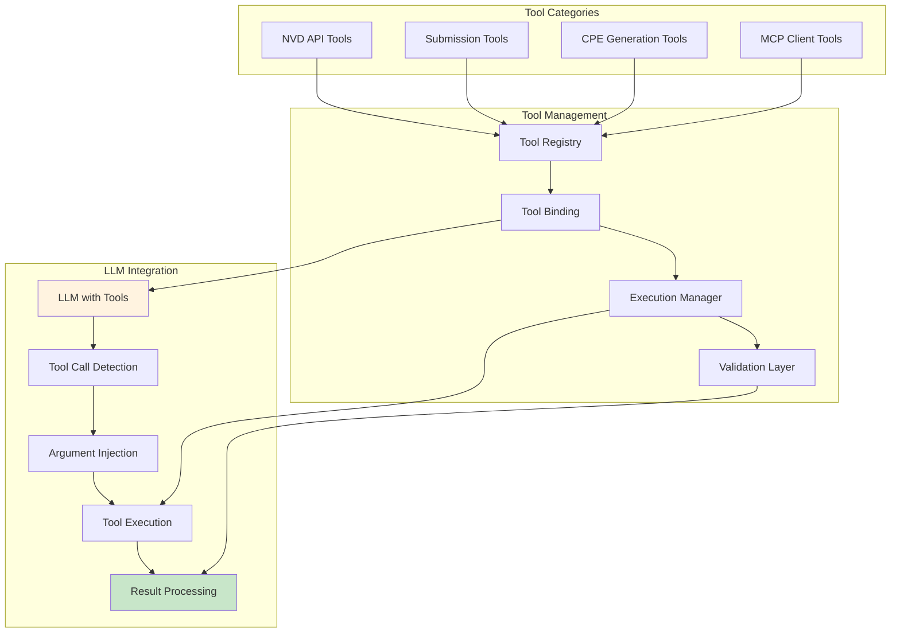
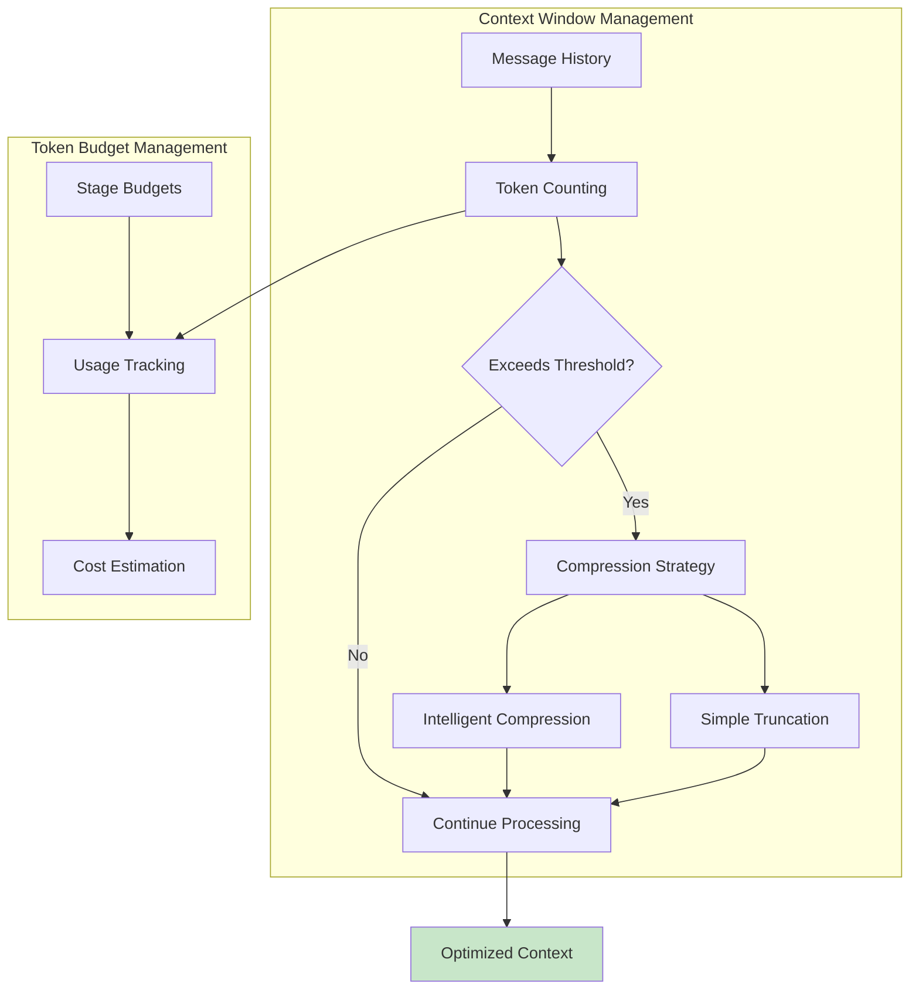

# AI-Powered Incident Analysis: Architecture Overview

## Summary

This system implements a multi-stage AI agent architecture that combines traditional data processing with Generative AI agentic patterns to analyze security incidents and prioritize CVE vulnerabilities. The architecture demonstrates multiple complementary strategies:

1. **Traditional Parsing**: Structured incident data extraction without LLM overhead
2. **Targeted AI Enhancement**: CPE generation using smaller, focused LLM operations
3. **Intelligent Pre-processing**: Automated vulnerability discovery and correlation
4. **Agentic Research & Analysis**: Advanced LLM reasoning with tool orchestration

## System Architecture Overview

## Multi-Phase Processing Pipeline

### Phase 1: Efficient Non-AI Parsing
**Purpose**: Extract structured data without LLM costs
**Implementation**: Traditional JSON parsing with validation

### Phase 2: Targeted CPE Enhancement
**Purpose**: Generate precise vulnerability identifiers using focused AI
**Implementation**: Batch processing with smaller LLM for efficiency

### Phase 3: Intelligent Vulnerability Pre-processing
**Purpose**: Create comprehensive vulnerability baseline using CPE data
**Implementation**: Automated NVD correlation with contextual filtering

### Phase 4: Agentic Research & Analysis
**Purpose**: Advanced reasoning and contextual analysis
**Implementation**: Multi-stage LLM agents with tool orchestration

## Agentic Stage Architecture

## Tool Integration Architecture

## Data Flow & Validation

```mermaid
graph LR
    subgraph "Input Validation"
        A[Raw Data] --> B[Schema Check]
        B --> C[Business Rules]
        C --> D[Sanitization]
    end
    
    subgraph "Processing Validation"
        E[Stage Input] --> F[Tool Validation]
        F --> G[Output Validation]
        G --> H[Cross-Reference Check]
    end
    
    subgraph "Output Validation"
        I[Analysis Result] --> J[Completeness Check]
        J --> K[Consistency Check]
        K --> L[Quality Metrics]
    end
    
    D --> E
    H --> I
    L --> M[Validated Output]
    
    style M fill:#c8e6c9
```

## Context & Token Management

## Key Architectural Advantages

### 1. **Efficiency Through Strategy Combination**
- **Non-AI parsing**: Eliminates unnecessary LLM costs for structured data
- **Targeted AI enhancement**: Uses smaller models for specific tasks (CPE generation)
- **Intelligent pre-processing**: Reduces agent workload through automated correlation
- **Focused agentic reasoning**: Applies expensive LLM operations only where advanced reasoning is needed

### 2. **Production-Ready Robustness**
- **Comprehensive error recovery**: Multiple fallback strategies at each stage
- **Validation framework**: Ensures data integrity throughout the pipeline
- **Context management**: Handles real-world token limitations
- **Monitoring & observability**: Token tracking, performance metrics, error logging

### 3. **Scalable Architecture**
- **Modular design**: Each stage can be independently scaled or modified
- **Configurable LLMs**: Different models for different stages based on requirements
- **Batch processing**: Efficient handling of multiple incidents
- **Resource optimization**: Token budgets and context compression

### 4. **Advanced Agentic Patterns**
- **Tool orchestration**: Dynamic tool selection and execution
- **Iterative reasoning**: Multi-turn conversations with validation
- **Structured outputs**: Pydantic models ensure consistent results
- **Explainable AI**: Complete reasoning chains and tool usage logs

This architecture demonstrates a sophisticated understanding of when and how to apply different AI strategies, combining efficiency with advanced reasoning capabilities to create a production-ready incident analysis system.