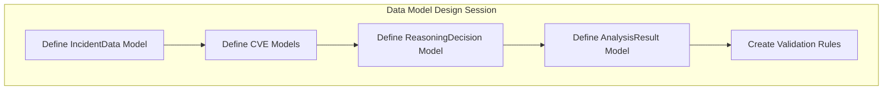
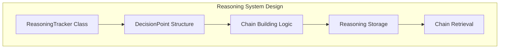

## Development Sequence & Design Breakdown

### Phase 1: Foundation & Core Infrastructure (Days 1-2)

#### 1.1 **Data Models & Interfaces** (Start Here)
```python
# Define core data structures first
- IncidentData (Pydantic models)
- CVEData models  
- ReasoningDecision models
- AnalysisResult models
```

**Why First**: Everything else depends on these contracts. Get the data flow right from the start.

#### 1.2 **Reasoning Tracker System**
```python
# Core reasoning capture mechanism
- ReasoningTracker class
- DecisionPoint logging
- Chain building utilities
```

**Why Second**: This needs to be available for all AI interactions, so build it early and integrate everywhere.

#### 1.3 **Token Management System**
```python
# Token efficiency foundation
- TokenCounter utility
- ContextOptimizer
- Basic caching mechanism
```

**Why Third**: Prevents token waste from the beginning. Better to build with constraints than optimize later.

### Phase 2: MCP Infrastructure (Day 2)

#### 2.1 **MCP Client Framework**
```python
# MCP integration foundation
- MCPClientManager
- Tool calling abstractions
- Result parsing utilities
```

#### 2.2 **Simulated MCP Servers** (MVP versions)
```python
# Start with simple, static data
- CVE Database MCP (JSON file backend)
- Asset Intelligence MCP (basic lookups)
- Threat Intel MCP (simple scoring)
```

**Why Now**: Need working tools before building the agent logic. Start simple, enhance later.

### Phase 3: Core Processing Pipeline (Days 3-4)

#### 3.1 **Incident Parser** (No AI needed)
```python
# Pure data processing
- Parse JSON structure
- Extract key fields
- Validate data integrity
- Structure for downstream processing
```

**Why First in Pipeline**: No AI dependency, pure data transformation. Can be fully tested independently.

#### 3.2 **Context Analyzer** (First AI component)
```python
# Simple AI reasoning
- Extract key context elements
- Identify asset types and roles
- Map TTPs to threat categories
- Generate structured context summary
```

**Why Second**: First real AI integration. Keep it simple and focused. Test reasoning capture here.

#### 3.3 **CVE Identifier** (Core AI logic)
```python
# AI + Tool integration
- Analyze context for CVE relevance
- Query CVE database via MCP
- Filter and rank potential matches
- Reason about relevance
```

**Why Third**: Builds on context analysis. Tests AI + tool integration patterns.

#### 3.4 **Risk Assessor** (Complex AI reasoning)
```python
# Multi-factor analysis
- Assess contextual risk factors
- Query threat intelligence
- Calculate composite risk scores
- Generate risk reasoning
```

**Why Fourth**: Most complex reasoning. Benefits from established patterns.

#### 3.5 **Prioritizer & Report Generator**
```python
# Final synthesis
- Combine all analysis
- Generate final prioritization
- Create human-readable reports
- Compile reasoning chains
```

**Why Last**: Synthesizes all previous work. Natural endpoint.

### Phase 4: Integration & Testing (Day 4-5)

#### 4.1 **Main Agent Controller**
```python
# Orchestration layer
- Pipeline coordination
- State management
- Error handling
- Metrics collection
```

#### 4.2 **End-to-End Testing**
```python
# Full system validation
- Process sample incidents
- Validate reasoning chains
- Test error scenarios
- Performance measurement
```

## Detailed Design Approach for Each Component

### Starting Point: Data Models (Day 1 Morning)



**Deliverable**: Complete Pydantic models with validation, serialization, and clear interfaces.

### Next: Reasoning Infrastructure (Day 1 Afternoon)



**Deliverable**: Working reasoning capture system that can be used by all AI components.

## Development Strategy Per Component

### For Each Component, Follow This Pattern:

1. **Design Session** (30-60 minutes)
   - Define inputs/outputs
   - Identify AI decision points
   - Plan reasoning capture
   - Design tool interactions

2. **Interface Definition** (30 minutes)
   - Abstract base classes
   - Method signatures
   - Data contracts

3. **MVP Implementation** (2-4 hours)
   - Core functionality only
   - Basic AI prompts
   - Simple tool calls

4. **Testing & Validation** (1-2 hours)
   - Unit tests
   - Reasoning validation
   - Token usage measurement

5. **Integration** (1 hour)
   - Connect to pipeline
   - End-to-end testing

## Recommended Starting Sequence

### Week 1 Schedule:
- **Day 1 AM**: Data models + Reasoning infrastructure
- **Day 1 PM**: Token management + MCP client framework
- **Day 2 AM**: Simulated MCP servers (basic versions)
- **Day 2 PM**: Incident Parser + Context Analyzer
- **Day 3 AM**: CVE Identifier
- **Day 3 PM**: Risk Assessor
- **Day 4 AM**: Prioritizer + Report Generator
- **Day 4 PM**: Main Controller + Integration
- **Day 5**: Testing, refinement, documentation

## Key Design Questions to Answer Early

1. **LLM Integration**: Which LLM API? How to handle rate limits?
2. **Prompt Strategy**: Template-based or dynamic prompt generation?
3. **Error Handling**: How to gracefully handle AI failures?
4. **Caching Strategy**: What to cache and for how long?
5. **Evaluation**: How to measure success at each component?

## Recommended Next Step

We should start with **Data Models** since everything else depends on getting the data contracts right. We should:

1. **Review the sample incident data** in detail
2. **Design the complete data model hierarchy**
3. **Define the reasoning capture structure**
4. **Create validation rules**
