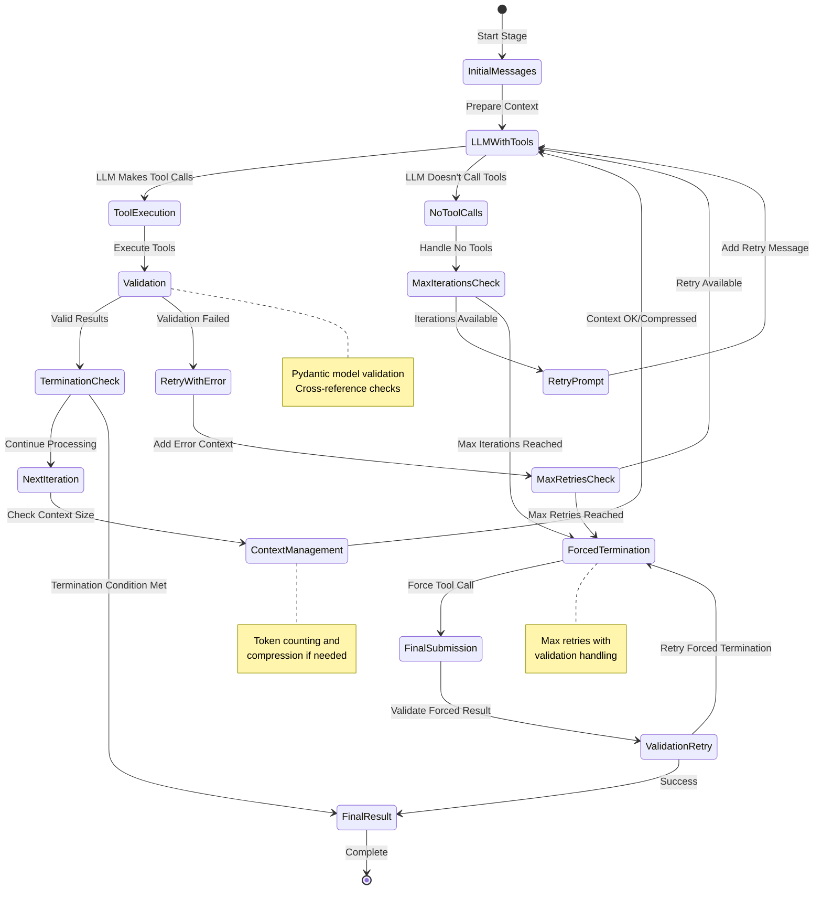

# Assignment Requirements Analysis

## Overview
This document maps the assignment requirements to the implemented AI-powered CVE analysis system, demonstrating how each requirement is fulfilled through the multi-stage agentic architecture.

---

## 1. Agent Design & LLM Application

### **Requirement Summary**
*Describe the architecture of your Gen AI agent. Explain how the LLM is used for reasoning, understanding context, and generating output. Detail the agent's workflow or state machine.*

### **Implementation**:

**Multi-Stage Agentic Architecture:**
The system implements a sophisticated 5-stage pipeline where LLMs are strategically applied for maximum efficiency:

- **CPE Extraction Stage**: Uses focused LLM to generate Common Platform Enumeration strings from incident data
- **Research Stage**: Employs agentic LLM with tool orchestration to gather contextual intelligence
- **Analysis Stage**: Utilizes advanced LLM reasoning to synthesize findings and prioritize vulnerabilities

**LLM Reasoning Patterns:**
- **Iterative Tool-Augmented Reasoning**: Each agentic stage uses `AgenticStageBase` with loop controllers that enable multi-turn conversations
- **Structured Output Generation**: LLMs generate validated Pydantic models ensuring consistent, parseable results
- **Context-Aware Processing**: Dynamic prompt injection with incident-specific data and vulnerability context

**State Machine Implementation:**


## 2. Prompting Strategy & Implementation

### **Requirement Summary**
*Detail the prompts or prompting strategy you use to guide the LLM's reasoning for CVE relevance and prioritization based on incident context.*

### **Implementation**:

**Multi-Stage Prompting Architecture:**
The system employs prompting strategies tailored to each processing stage, with dynamic context injection and structured reasoning requirements.

### **1. CPE Generation Stage Prompting**

**Strategy**: Focused, rule-based prompting with extensive validation requirements
**Purpose**: Generate precise vulnerability identifiers with maximum specificity

**System Prompt Approach:**
```python
# Excerpt from construct_cpes_system_prompt.py
CONSTRUCT_CPES_SYSTEM_PROMPT = """Expert cybersecurity analyst generating CPE 2.3 strings...
## SPECIFICITY REQUIREMENTS:
**CRITICAL:** Use ALL available version information. Never use wildcards (*) when specific data exists.
### Version Field Guidelines:
- Use EXACT version numbers when available (e.g., `9.0.50`, `2019.10.1803.1`, `21.04`)
- Include patch levels, build numbers, service packs when provided
**VALIDATION CHECK:** Count colons - there should be EXACTLY 12 colons in each CPE string!
```

### **2. Research Stage Prompting**

**Strategy**: Systematic investigation with contextual prioritization
**Purpose**: Gather intelligence for informed vulnerability analysis

**Key Prompt Elements:**
```python
# From research_system_prompt.py
"You are an expert cybersecurity researcher...
## Research Strategy:
1. **Start with Known Components**: Begin with software explicitly mentioned
2. **Expand Contextually**: Research related components, attack vectors
3. **Follow Leads**: Pursue findings revealing additional relevant information
4. **Validate Findings**: Cross-check discoveries across multiple sources"
```

**Dynamic Context Injection:**
```python
# From research_user_prompt.py
"## Top CVEs (Research Priority)
{top_cves_list}
## TTPs
{observed_ttps_info}
## Research Objectives
1. **CVE Deep Dive**: Research each listed CVE for exploitation status, PoCs
2. **TTP Research**: Research attack patterns, related campaigns, threat actors"
```

### **3. Core Prompting Strategies**

**Consistent Design Patterns:**
- **Role-Based Expertise**: Each stage establishes clear expert persona
- **Tool-First Approach**: `NEVER answer directly in chat` - forces structured tool usage
- **Validation Integration**: Built-in format checking and quality requirements
- **Context Preservation**: Dynamic injection of incident-specific data via templates
- **Reasoning Chain Enforcement**: Explicit requirements for step-by-step analysis with source citations

**Context Management:**
- **Template-Based Injection**: Incident data dynamically inserted into prompt templates
- **Progressive Context Building**: Each stage builds upon previous findings
- **Token-Aware Compression**: Context automatically compressed when approaching limits

---

## 3. Tool Use (Simulated/Open Source)

### **Requirement Summary**
*Identify potential tools or data sources the agent would need to interact with. Explain how the agent would decide which tool to use and how it would interpret the results. Implementation should simulate interaction with at least one such tool/data source.*

### **Implementation**:

**Comprehensive Tool Ecosystem:**
- **NVD API Tools**: `search_cves_by_keyword`, `search_cves_by_cpe`, `get_cve_details` for real-time vulnerability data
- **CPE Generation Tools**: `generate_cpes_for_batch` for automated vulnerability identifier creation
- **Submission Tools**: `submit_research`, `submit_analysis` with comprehensive validation to reduce or prevent hallucinations
- **MCP Client Support**: Extensible framework for external tool integration, allowing plug-and-play addition of tools without code changes

**Tool Decision Logic:**
- **Stage-Based Tool Binding**: Each stage has configured available tools (`available_tools` in stage config)
- **Dynamic Tool Selection**: LLMs choose appropriate tools based on context and task requirements (after the initial tool selection by stage)
- **Validation-Driven Retry**: Failed tool calls trigger retry with error context injection, prompting the LLM to resolve its own mistakes
- **Fallback Strategies**: Multiple tool options with graceful degradation

**Tool Result Interpretation:**
- **Structured Validation**: All tool outputs validated against Pydantic schemas
- **Cross-Reference Verification**: Tool results validated against original incident data
- **Error Recovery**: Validation failures trigger specific retry prompts with corrective guidance

---

## 4. Implementation (Core Agent Logic)

### **Requirement Summary**
*Provide source code for your working Gen AI agent component using your chosen framework. The code should demonstrate the agent's core reasoning loop, interaction with simulated tools/data, and processing of sample incident data.*

### **Implementation**:

**Framework Selection**: LangChain with custom agentic extensions

***Note:*** I chose to go with LangChain and a custom agentic implementation, as I had already had some code which did some of the iterative tool calling.  I have also found LangGraph and some of the other frameworks to be too heavy weight and restrictive at times, often not supporting the workflows I want without heavy modification.

**Core Agent Logic Implementation:**
- **`AgenticStageBase`**: Abstract base providing common agentic patterns
- **`AgenticLoopController`**: Manages iterative reasoning with termination conditions
- **`AgenticToolManager`**: Handles tool registration, binding, and execution
- **Error Recovery Mixins**: Comprehensive error handling and retry logic

**Working Sample Processing:**
The system processes the provided 39-incident dataset through the complete pipeline, demonstrating real-world applicability.

---

## 5. Data Preparation for LLM

### **Requirement Summary**
*Explain how you prepare the incident data and relevant CVE information to be provided as context to the LLM. How do you handle the context window limitations of the LLM?*

### **Implementation**:

**Multi-Layer Data Preparation:**

1. **Incident Data Enhancement**:
   - **CPE Generation**: Light-weight LLM generated CPEs from asset and software names and versions
   - **CVE Lookup**: Automated CVE lookup by CPE prior to LLM analysis

2. **Context Optimization**:
   - **Structured Prompt Templates**: Dynamic injection of incident-specific data
   - **Relevance Filtering**: Only include CVEs above configurable relevance thresholds
   - **Hierarchical Summarization**: Key findings summarized at each stage

**Context Window Management:**

**Advanced Token Management System:**
- **Token Counting**: Uses `tiktoken` for accurate token estimation across model types
- **Context Compression**: Multiple strategies implemented:
  - **Intelligent Compression**: LLM-based summarization preserving critical information
  - **Tool-Based Compression**: Specialized compression tools for domain-specific optimization
    - ***Note:*** *The tool-based part of the compression here is not yet implemented, but I did put the framework in place*
  - **Simple Truncation**: Fallback strategy preserving recent messages

**Context Preservation Strategies:**
- **System Message Preservation**: Critical instructions always maintained
- **Recent Message Priority**: Latest interactions preserved for continuity
- **Structured Data Compression**: Complex data structures intelligently summarized (using prompting for now, tools possible in the future)

---

## 6. Output & Explainability

### **Requirement Summary**
*Describe the output of your agent, focusing on the prioritized list and the generated analysis/justification. How do you design the agent's prompts or workflow to ensure the LLM provides clear, traceable reasoning for its conclusions?*

### **Implementation**:

**Structured Output Framework:**

**Primary Outputs:**
At various stages outputs are generated, but the final outputs are two reports- a technical report and a "customer facing" report.
- **Technical Report (_report.md)**: Comprehensive analysis with prioritized CVE list, asset risk assessments, and actionable recommendations, along with detailed tool logs and reasoning output
- **Customer Facing Report (_customer_report.md)**: A lighter weight version of the full report, with an easy-to-read executive summary and recommended actions
- **Intermediate Stage Outputs**: Intermediate stage outputs are available, but not output, which contain the myriad details of the underlying incidents and investigation that has been undertaken. 

**Explainability Implementation:**

1. **Reasoning Chain Capture**:
   ```python
   class IncidentAnalysisResult(BaseModel):
       reasoning_chain: List[str] = Field(description="Step-by-step reasoning process")
       data_sources_used: List[str] = Field(description="Data sources consulted")
       limitations_and_assumptions: List[str] = Field(description="Analysis limitations")
   ```
   - These are captured in the final technical report

2. **Tool Usage Transparency**:
   - Complete tool call logs with arguments and results
   - Decision rationale for tool selection
   - Validation steps and error recovery actions

3. **Validation and Quality Metrics**:
   - **Tool Calls Validated**: All tool calls are validated, where possible, against existing data (such as existing incident data)
   - **Tool Call Statistics**: Since tool calls (success and failure) are captured in the technical report, it is easy to see which prompts/tools are working, and which need tuning

**Prompt Design for Explainability:**
- **Structured Reasoning Requirements**: Prompts explicitly request step-by-step analysis
- **Evidence-Based Conclusions**: Require citations to specific data sources
- **Confidence Scoring**: LLMs provide confidence levels for major conclusions
- **Alternative Consideration**: Prompts encourage consideration of alternative interpretations

**Example Output Structure:**
```
Executive Summary: [High-level findings]
├── CVE Prioritization: [Ranked list with justification]
├── Asset Risk Assessment: [Per-asset analysis with evidence]
├── Attack Chain Analysis: [Potential exploitation paths]
├── Reasoning Chain: [Step-by-step decision process]
└── Tool Usage Log: [Complete audit trail]
```

---

## 7. Evaluation Metrics

### **Requirement Summary**
*How would you evaluate the effectiveness and quality of the agent's output and reasoning? What specific metrics are most relevant? How would you collect ground truth or evaluate subjective quality?*

### **Implementation**:

A number of these are things I *would* do, given the time.  As it is, only some of them are currently implemented.

**Multi-Dimensional Evaluation Framework:**

### **1. Quantitative Metrics**
- **CVE Relevance Precision**: >85% of identified CVEs are actually relevant
- **CVE Recall**: >90% of truly relevant CVEs identified
- **Priority Ranking Correlation**: >0.8 Spearman correlation with expert rankings
- **Processing Time**: <5 minutes per incident
- **Cost Efficiency**: <$2.00 per incident analysis

### **2. Quality Metrics**
- **Reasoning Chain Completeness**: 5-8 logical steps per analysis
- **Evidence Citation Rate**: >90% of conclusions backed by specific evidence
- **Explanation Clarity**: >8/10 human evaluator rating
- **Tool Success Rate**: >95% successful tool executions

### **3. Automated Ground Truth Validation (Implemented)**
**Tool-Based Validation Against Incident Data:**
- **Submit Analysis Tool**: Validates CVE references, hostnames, IP addresses against original incident data
- **Submit Research Tool**: Cross-references findings with known incident assets and TTPs
- **Generate CPEs Tool**: Validates CPE strings against actual software/hardware in incident
- **Data Consistency Scoring**: Automated measurement of AI output alignment with source incident data
- **Hallucination Detection**: Flags AI-generated content not supported by incident evidence

### **4. Built-in Quality Assurance**
- **Completeness Assessment**: Asset coverage, TTP analysis gaps automatically identified
- **Cross-Reference Validation**: CVE references verified against vulnerability reports
- **Tool Usage Verification**: All tool calls validated against expected outputs and incident context
- **Validation Pass Rate**: Boolean indicator tracking percentage of analyses passing all checks

### **5. Continuous Monitoring**
- **A/B Testing**: AI-assisted vs manual analyst prioritization
- **Retrospective Analysis**: Compare recommendations with actual incident outcomes
- **Performance Drift**: Monitor accuracy degradation over time
- **Quality Gates**: Automatic rejection if validation pass rate <80%

### **6. Real-World Ground Truth Collection Methodology**

**Expert Annotation Process:**
- **Incident-CVE Relevance Labeling**: Security analysts review historical incidents and mark CVEs as "Highly Relevant", "Somewhat Relevant", or "Not Relevant" based on actual exploitation potential
- **Priority Ranking Validation**: Subject matter experts rank CVEs by actual remediation priority for each incident type, creating gold standard rankings
- **Inter-Rater Reliability**: Multiple analysts independently label the same incidents, measuring agreement using Cohen's kappa (target: >0.8)

**Retrospective Analysis:**
- **Outcome Tracking**: Follow incidents through resolution to identify which CVEs were actually exploited or required immediate patching
- **Post-Incident Reviews**: Capture analyst decisions and reasoning during actual incident response for training data
- **Remediation Correlation**: Track which CVE fixes actually prevented similar incidents

**Continuous Validation:**
- **A/B Testing**: Compare AI recommendations against human analyst decisions in live (low-risk) scenarios
- **Feedback Loops**: Capture analyst corrections and disagreements with AI outputs for model improvement
- **Quality Metrics**: Track analyst time savings, decision confidence scores, and recommendation acceptance rates

---

## 8. Production Considerations

### **Requirement Summary**
*Discuss key challenges and considerations for deploying and maintaining this type of Gen AI agent in a production security environment.*

### **Response**:

**Critical Production Challenges & Solutions:**

**1. Cost & Performance Optimization:**
- **Challenge**: LLM API costs can scale rapidly with incident volume
- **Solution**: 
  - Strategic AI application (non-AI parsing, targeted enhancement)
  - Token budget management with configurable limits
  - Model selection per stage (smaller models for focused tasks)
  - Context compression to minimize token usage
  - Response and tool call caching for repeated queries

**2. Reliability & Error Handling:**
- **Challenge**: LLM non-determinism and potential failures
- **Solution**:
  - Comprehensive validation framework with retry logic
  - Multiple fallback strategies at each stage
  - Graceful degradation when tools fail
  - Circuit breaker patterns for external API dependencies
  - Fallback to different LLMs or different providers in case of failures

**3. Security & Compliance:**
- **Challenge**: Handling sensitive incident data and ensuring output safety
- **Solution**:
  - Input sanitization and validation
  - Output content filtering
  - Audit trails for compliance requirements
  - Role-based access controls
  - Data retention and privacy controls

**4. Scalability & Resource Management:**
- **Challenge**: Handling varying incident loads and resource constraints
- **Solution**:
  - Async processing with proper resource pooling
  - Batch processing capabilities
  - Configurable concurrency limits
  - Auto-scaling based on queue depth
  - Resource monitoring and alerting

**5. Monitoring & Observability:**
- **Challenge**: Creating a monitoring solution that surfaces meaningful information while still capturing all of the necessary details
- **Solution**: 
  - Integration of third party logging/monitoring solutions
  - Comprehensive and pervasive logging throughout the application(s)
  - Reporting solutions that allow custom filtering / views

**6. Prompt Engineering Robustness:**
- **Challenge**: Ensuring consistent performance across diverse incident types
- **Solution**:
  - Extensive prompt testing with edge cases
  - Version control for prompt templates
  - A/B testing for prompt optimization
  - Fallback prompts for edge cases

**7. Model Drift & Maintenance:**
- **Challenge**: LLM behavior changes over time
- **Solution**:
  - Continuous validation against benchmark datasets
  - Model version pinning with controlled updates
  - Performance regression testing
  - Human-in-the-loop validation for critical decisions
    - ***This could be if we were to automate patching or something along those lines***

**Operational Considerations:**
- **24/7 Monitoring**: Real-time dashboards for system health and quality metrics
- **Incident Response**: Automated alerting for system failures or quality degradation
- **Capacity Planning**: Predictive scaling based on historical incident patterns
- **Disaster Recovery**: Backup processing capabilities and data recovery procedures

## 9. Future Improvements

### **Performance & Scalability Enhancements**

**Parallelization Opportunities:**
- **Concurrent Tool Execution**: Implement parallel tool calls within agentic loops when tools don't have dependencies
- **Batch Incident Processing**: Process multiple incidents simultaneously with configurable concurrency limits
- **Stage Parallelization**: Enable parallel execution of independent stages (e.g., research and pre-processing for different incidents)
- **CPE Generation Batching**: Enhance batch processing in `CPEExtractionStage` with async/await patterns for large incident sets

**Caching & Optimization:**
- **CVE Response Caching**: Implement Redis/memory caching for NVD API responses to reduce redundant calls
- **LLM Response Caching**: Cache LLM responses for identical prompts and contexts
- **Incremental Processing**: Support resuming analysis from failed stages without reprocessing completed work
- **Connection Pooling**: Implement connection pooling for NVD API and MCP clients

### **Advanced AI Capabilities**

**Enhanced Reasoning:**
- **Multi-Agent Collaboration**: Implement competing analysis agents with consensus mechanisms
- **Confidence Calibration**: Add uncertainty quantification to AI outputs with confidence intervals
- **Active Learning**: Implement feedback loops to improve model performance based on analyst corrections
- **Few-Shot Learning**: Dynamic prompt enhancement with relevant historical examples

**Advanced Tool Integration:**
- **Streaming Tool Responses**: Support streaming responses for long-running tools (e.g., comprehensive vulnerability scans)
- **Tool Composition**: Enable chaining tools automatically based on output dependencies
- **Dynamic Tool Discovery**: Runtime discovery and integration of new MCP tools
- **Tool Performance Monitoring**: Track and optimize tool usage patterns and success rates

### **Production Readiness**

**Monitoring & Observability:**
- **Distributed Tracing**: Implement OpenTelemetry for end-to-end request tracing
- **Real-time Dashboards**: Grafana/Prometheus integration for system health monitoring
- **Quality Metrics Pipeline**: Automated quality assessment with alerting on degradation
- **Cost Tracking**: Per-incident cost analysis and budget controls

**Reliability & Resilience:**
- **Circuit Breaker Patterns**: Implement circuit breakers for external API dependencies
- **Graceful Degradation**: Fallback strategies when premium tools/APIs are unavailable
- **Checkpoint/Resume**: Save intermediate state to enable recovery from failures
- **Multi-Provider LLM Support**: Automatic failover between LLM providers

### **Data & Integration Enhancements**

**Enhanced Data Sources:**

- **Threat Intelligence Feeds**: Integration with commercial threat intel providers
- **OSINT Integration**: Automated open-source intelligence gathering
- **Historical Incident Database**: Learn from past incident patterns and outcomes
- **Real-time Vulnerability Feeds**: Beyond NVD, integrate with vendor-specific feeds

**Advanced Analytics:**
- **Trend Analysis**: Identify emerging vulnerability patterns across incidents
- **Risk Modeling**: Predictive models for vulnerability exploitation likelihood
- **Attack Path Modeling**: Graph-based analysis of potential attack chains
- **Impact Simulation**: Monte Carlo simulation of potential business impact

### **User Experience & Interface**

**Interactive Features:**
- **Web Dashboard**: Real-time incident analysis dashboard with drill-down capabilities
- **Analyst Feedback Interface**: Streamlined interface for analyst corrections and improvements
- **Report Customization**: Template-based report generation for different stakeholders
- **API Gateway**: RESTful API for integration with existing security tools

**Workflow Integration:**
- **SOAR Integration**: Native integration with Security Orchestration platforms
- **Ticketing System Integration**: Automatic ticket creation and updates
- **Notification Systems**: Intelligent alerting based on risk levels and urgency
- **Approval Workflows**: Multi-stage approval for high-impact recommendations

### **Security & Compliance**

**Enhanced Security:**
- **Data Encryption**: End-to-end encryption for sensitive incident data
- **Access Controls**: Role-based access control with audit logging
- **Data Retention Policies**: Automated data lifecycle management
- **Privacy Controls**: PII detection and redaction capabilities

**Compliance Features:**
- **Audit Trails**: Comprehensive logging for compliance requirements
- **Data Lineage**: Track data flow and transformations throughout the pipeline
- **Regulatory Reporting**: Automated compliance report generation
- **Data Sovereignty**: Geographic data processing controls

### **Machine Learning & Automation**

**Continuous Learning:**
- **Model Fine-tuning**: Automated retraining based on analyst feedback
- **Prompt Optimization**: A/B testing and optimization of prompt templates
- **Anomaly Detection**: Identify unusual incident patterns requiring special attention
- **Automated Validation**: ML-based validation of AI outputs against historical patterns

**Advanced Automation:**
- **Auto-remediation**: Automated patch deployment for low-risk, high-confidence scenarios
- **Incident Correlation**: Automatic linking of related incidents and campaigns
- **Threat Hunting**: Proactive identification of potential incidents based on vulnerability intelligence
- **Predictive Analytics**: Forecast future vulnerability trends and attack patterns