# AI-Powered Incident Analysis System Overview

## System Purpose
A multi-stage AI agent system that analyzes security incidents, identifies relevant vulnerabilities, and prioritizes CVE remediation using advanced Gen AI agentic patterns combined with efficient traditional processing.

## Application Flow

```mermaid
graph 
    A[📄 Incident JSON] --> B[🔍 Parse & Validate]
    B --> C[🏷️ CPE Generation]
    C --> D[🔍 Vulnerability Discovery]
    D --> E[🤖 AI Research Agent]
    E --> F[🧠 AI Analysis Agent]
    F --> G[📊 Report Generation]
```

## Multi-Strategy Architecture

| Stage | Strategy | Technology | Purpose |
|-------|----------|------------|---------|
| **Parsing** | Traditional Processing | JSON Schema Validation | Extract structured incident data  |
| **CPE Enhancement** | Targeted AI | Small LLM + Validation | Generate precise vulnerability identifiers |
| **Pre-processing** | Intelligent Automation | NVD API + Filtering | Build comprehensive vulnerability baseline |
| **Research** | Agentic AI | LLM + Multiple Tool Orchestration | Gather contextual intelligence |
| **Analysis** | Agentic AI | LLM + Advanced Reasoning | Prioritize and assess risk |
| **Reporting** | Template Generation | Structured Output | Deliver actionable insights |

## Key Architectural Choices

### **Strategic AI Application**
- **Non-AI parsing** eliminates unnecessary LLM costs for structured data
- **Targeted CPE generation** uses smaller models for specific enhancement tasks
- **Agentic reasoning** applied only where advanced analysis is required

### **Advanced Tool Orchestration**
- **NVD API integration** for real-time vulnerability data
- **MCP client support** for external tool ecosystem, including Vulnerability Intelligence services
- **Dynamic tool binding** with validation and retry logic
- **Structured submission tools** ensuring output quality

### **Production-Ready Robustness**
- **Multi-level validation** with comprehensive error recovery
- **Context window management** with intelligent compression
- **Token budget optimization** across all stages
- **Configurable LLM selection** per stage requirements

### **Sophisticated Agentic Patterns**
- **Iterative reasoning loops** with termination conditions
- **Tool-augmented decision making** with fallback strategies
- **Structured output validation** using Pydantic models
- **Complete audit trails** for explainability and debugging

## Data Flow Example

```mermaid
graph TB
    A["🚨 VPN Brute Force Incident"] --> B["📋 Extract: Assets, TTPs, IOCs"]
    B --> C["🏷️ Generate CPE Strings<br/>cpe:2.3:a:cisco:ios_xe:17.3.4a"]
    C --> D["🔍 Discover 15 CVEs<br/>Including CVE-2023-20198 (Critical)"]
    D --> E["🤖 Research Agent<br/>Gathers threat intelligence"]
    E --> F["🧠 Analysis Agent<br/>Prioritizes by context & impact"]
    F --> G["📊 Executive Summary<br/>+ Technical Report"]    
```

## Technical Highlights

### **Framework Integration**
- **LangChain and Custom Agents** for agentic workflows
- **Pydantic** for structured data validation
- **Multiple LLM providers** (OpenAI, Anthropic, Azure, Local, etc.)
- **Async processing** with proper error handling

### **Quality Assurance**
- **Automated validation** against incident data to prevent hallucinations
- **Tool usage verification** with retry logic and max iterations
- **Output completeness checks** and consistency validation
- **Human-readable audit trails** for transparency (captured in full report)

## Business Value

| Capability | Traditional Approach | This System |
|------------|---------------------|-------------|
| **CVE Identification** | Manual database searches | Automated CPE-enhanced discovery |
| **Risk Assessment** | Static CVSS scores | Contextual incident-specific analysis |
| **Prioritization** | Generic severity rankings | AI-driven impact assessment |
| **Documentation** | Manual report writing | Automated technical + executive reports |
